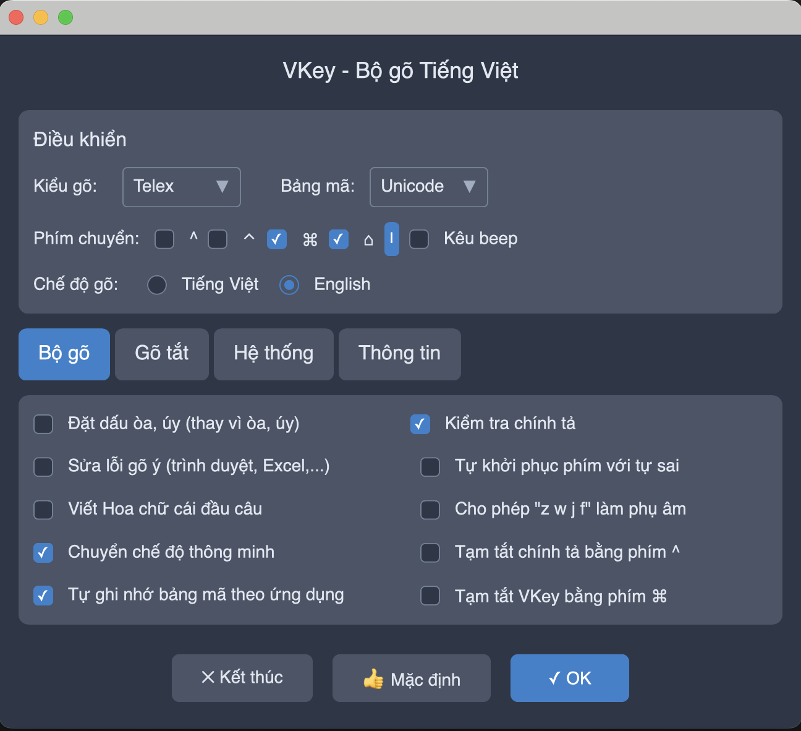

# VKey - Vietnamese Input Method

A simple Vietnamese input method application built with Rust using GPUI and vi-rs.

## Screenshot



*VKey application showing the main configuration interface with input method settings, keyboard shortcuts, and advanced options.*

## Features

- Real-time Vietnamese text conversion using VNI input method
- Clean and modern UI
- Keyboard input handling
- Support for backspace

## Requirements

- Rust 1.70 or later
- Cargo

## Building

```bash
cargo build --release
```

## Running

```bash
cargo run --release
```

## Usage

1. Type using VNI input method:
   - Use numbers 1-6 for tone marks
   - Example: "vie6t5" will be converted to "việt"

2. Use backspace to delete characters

## Input Method Reference

VNI input method uses numbers to add diacritical marks:

- 1: dấu sắc (á)
- 2: dấu huyền (à)
- 3: dấu hỏi (ả)
- 4: dấu ngã (ã)
- 5: dấu nặng (ạ)
- 6: dấu mũ (â, ê, ô)
- 7: dấu móc (ă, ơ, ư)
- 8: dấu trăng (ă)
- 9: dấu râu (đ)

## License

MIT License 